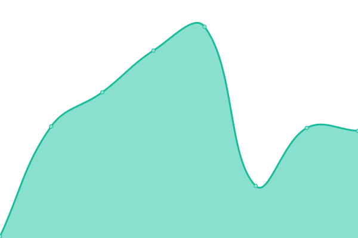
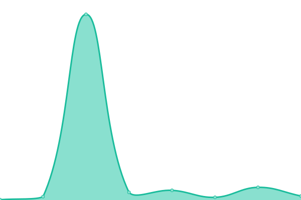
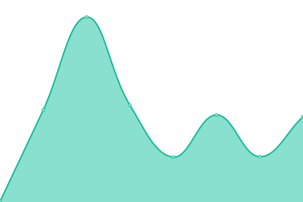
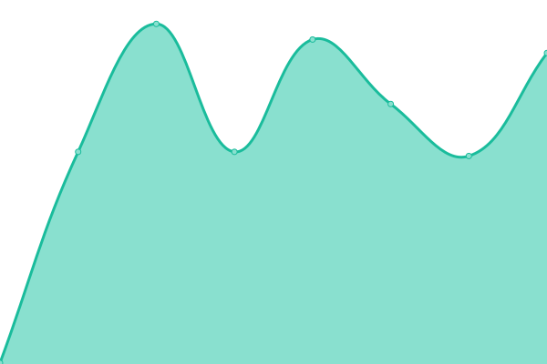

# [📈 Live Status](https://xlabs.github.io/app-status): <!--live status--> **🟨 Degraded performance**

This repository contains the open-source uptime monitor and status page for [xLabs](https://xlabs.github.io/app-status), powered by [Upptime](https://github.com/upptime/upptime).

With [Upptime](https://upptime.js.org), you can get your own unlimited and free uptime monitor and status page, powered entirely by a GitHub repository. We use [Issues](https://github.com/xlabs/app-status/issues) as incident reports, [Actions](https://github.com/xlabs/app-status/actions) as uptime monitors, and [Pages](https://xlabs.github.io/app-status) for the status page.

<!--start: status pages-->
<!-- This summary is generated by Upptime (https://github.com/upptime/upptime) -->
<!-- Do not edit this manually, your changes will be overwritten -->
<!-- prettier-ignore -->
| URL | Status | History | Response Time | Uptime |
| --- | ------ | ------- | ------------- | ------ |
|  [Portal Bridge](https://portalbridge.com) | 🟩 Up | [portal-bridge.yml](https://github.com/XLabs/app-status/commits/HEAD/history/portal-bridge.yml) | 

 146ms
     
 | 

<a href="https://xlabs.github.io/app-status/history/portal-bridge">100.00%</a>
    

|  [USDC Bridge](https://portalbridge.com/usdc-bridge/) | 🟩 Up | [usdc-bridge.yml](https://github.com/XLabs/app-status/commits/HEAD/history/usdc-bridge.yml) | 

 8ms
     
 | 

<a href="https://xlabs.github.io/app-status/history/usdc-bridge">100.00%</a>
    

|  [Wormholescan](https://wormholescan.io) | 🟩 Up | [wormholescan.yml](https://github.com/XLabs/app-status/commits/HEAD/history/wormholescan.yml) | 

 159ms
     
 | 

<a href="https://xlabs.github.io/app-status/history/wormholescan">100.00%</a>
    

|  [Wormholescan API](https://api.wormholescan.io/api/v1/health) | 🟩 Up | [wormholescan-api.yml](https://github.com/XLabs/app-status/commits/HEAD/history/wormholescan-api.yml) | 

 331ms
     
 | 

<a href="https://xlabs.github.io/app-status/history/wormholescan-api">100.00%</a>
    

|  [Solana](https://vaa-status-check.netlify.app/network/1) | 🟩 Up | [solana.yml](https://github.com/XLabs/app-status/commits/HEAD/history/solana.yml) | 

 795ms
     
 | 

<a href="https://xlabs.github.io/app-status/history/solana">39.82%</a>
    

|  [Ethereum](https://vaa-status-check.netlify.app/network/2) | 🟩 Up | [ethereum.yml](https://github.com/XLabs/app-status/commits/HEAD/history/ethereum.yml) | 

 254ms
     
 | 

<a href="https://xlabs.github.io/app-status/history/ethereum">39.76%</a>
    

|  [Terra](https://vaa-status-check.netlify.app/network/3) | 🟩 Up | [terra.yml](https://github.com/XLabs/app-status/commits/HEAD/history/terra.yml) | 

 271ms
     
 | 

<a href="https://xlabs.github.io/app-status/history/terra">39.68%</a>
    

|  [BSC](https://vaa-status-check.netlify.app/network/4) | 🟩 Up | [bsc.yml](https://github.com/XLabs/app-status/commits/HEAD/history/bsc.yml) | 

 205ms
     
 | 

<a href="https://xlabs.github.io/app-status/history/bsc">39.63%</a>
    

|  [Polygon](https://vaa-status-check.netlify.app/network/5) | 🟩 Up | [polygon.yml](https://github.com/XLabs/app-status/commits/HEAD/history/polygon.yml) | 

 217ms
     
 | 

<a href="https://xlabs.github.io/app-status/history/polygon">39.55%</a>
    

|  [Avalanche](https://vaa-status-check.netlify.app/network/6) | 🟩 Up | [avalanche.yml](https://github.com/XLabs/app-status/commits/HEAD/history/avalanche.yml) | 

 194ms
     
 | 

<a href="https://xlabs.github.io/app-status/history/avalanche">39.51%</a>
    

|  [Oasis](https://vaa-status-check.netlify.app/network/7) | 🟩 Up | [oasis.yml](https://github.com/XLabs/app-status/commits/HEAD/history/oasis.yml) | 

 263ms
     
 | 

<a href="https://xlabs.github.io/app-status/history/oasis">39.46%</a>
    

|  [Algorand](https://vaa-status-check.netlify.app/network/8) | 🟩 Up | [algorand.yml](https://github.com/XLabs/app-status/commits/HEAD/history/algorand.yml) | 

 293ms
     
 | 

<a href="https://xlabs.github.io/app-status/history/algorand">39.38%</a>
    

|  [Fantom](https://vaa-status-check.netlify.app/network/10) | 🟩 Up | [fantom.yml](https://github.com/XLabs/app-status/commits/HEAD/history/fantom.yml) | 

 252ms
     
 | 

<a href="https://xlabs.github.io/app-status/history/fantom">39.33%</a>
    

|  [Karura](https://vaa-status-check.netlify.app/network/11) | 🟩 Up | [karura.yml](https://github.com/XLabs/app-status/commits/HEAD/history/karura.yml) | 

 256ms
     
 | 

<a href="https://xlabs.github.io/app-status/history/karura">39.25%</a>
    

|  [Acala](https://vaa-status-check.netlify.app/network/12) | 🟩 Up | [acala.yml](https://github.com/XLabs/app-status/commits/HEAD/history/acala.yml) | 

 273ms
     
 | 

<a href="https://xlabs.github.io/app-status/history/acala">39.20%</a>
    

|  [Klaytn](https://vaa-status-check.netlify.app/network/13) | 🟩 Up | [klaytn.yml](https://github.com/XLabs/app-status/commits/HEAD/history/klaytn.yml) | 

 553ms
     
 | 

<a href="https://xlabs.github.io/app-status/history/klaytn">43.72%</a>
    

|  [Celo](https://vaa-status-check.netlify.app/network/14) | 🟩 Up | [celo.yml](https://github.com/XLabs/app-status/commits/HEAD/history/celo.yml) | 

 254ms
     
 | 

<a href="https://xlabs.github.io/app-status/history/celo">18.30%</a>
    

|  [Near](https://vaa-status-check.netlify.app/network/15) | 🟩 Up | [near.yml](https://github.com/XLabs/app-status/commits/HEAD/history/near.yml) | 

 287ms
     
 | 

<a href="https://xlabs.github.io/app-status/history/near">43.72%</a>
    

|  [Moonbeam](https://vaa-status-check.netlify.app/network/16) | 🟩 Up | [moonbeam.yml](https://github.com/XLabs/app-status/commits/HEAD/history/moonbeam.yml) | 

 205ms
     
 | 

<a href="https://xlabs.github.io/app-status/history/moonbeam">43.68%</a>
    

|  [Terra2](https://vaa-status-check.netlify.app/network/18) | 🟩 Up | [terra2.yml](https://github.com/XLabs/app-status/commits/HEAD/history/terra2.yml) | 

 407ms
     
 | 

<a href="https://xlabs.github.io/app-status/history/terra2">43.66%</a>
    

|  [Injective](https://vaa-status-check.netlify.app/network/19) | 🟩 Up | [injective.yml](https://github.com/XLabs/app-status/commits/HEAD/history/injective.yml) | 

 247ms
     
 | 

<a href="https://xlabs.github.io/app-status/history/injective">24.14%</a>
    

|  [Sui](https://vaa-status-check.netlify.app/network/21) | 🟨 Degraded | [sui.yml](https://github.com/XLabs/app-status/commits/HEAD/history/sui.yml) | 

 238ms
     
 | 

<a href="https://xlabs.github.io/app-status/history/sui">0.03%</a>
    

|  [Aptos](https://vaa-status-check.netlify.app/network/22) | 🟩 Up | [aptos.yml](https://github.com/XLabs/app-status/commits/HEAD/history/aptos.yml) | 

 237ms
     
 | 

<a href="https://xlabs.github.io/app-status/history/aptos">18.29%</a>
    

|  [Arbitrum](https://vaa-status-check.netlify.app/network/23) | 🟩 Up | [arbitrum.yml](https://github.com/XLabs/app-status/commits/HEAD/history/arbitrum.yml) | 

 242ms
     
 | 

<a href="https://xlabs.github.io/app-status/history/arbitrum">25.85%</a>
    

|  [Optimism](https://vaa-status-check.netlify.app/network/24) | 🟩 Up | [optimism.yml](https://github.com/XLabs/app-status/commits/HEAD/history/optimism.yml) | 

 245ms
     
 | 

<a href="https://xlabs.github.io/app-status/history/optimism">100.00%</a>
    

|  [Xpla](https://vaa-status-check.netlify.app/network/28) | 🟩 Up | [xpla.yml](https://github.com/XLabs/app-status/commits/HEAD/history/xpla.yml) | 

 174ms
     
 | 

<a href="https://xlabs.github.io/app-status/history/xpla">100.00%</a>
    

|  [Base](https://vaa-status-check.netlify.app/network/30) | 🟩 Up | [base.yml](https://github.com/XLabs/app-status/commits/HEAD/history/base.yml) | 

 240ms
     
 | 

<a href="https://xlabs.github.io/app-status/history/base">100.00%</a>
    

|  [Sei](https://vaa-status-check.netlify.app/network/32) | 🟨 Degraded | [sei.yml](https://github.com/XLabs/app-status/commits/HEAD/history/sei.yml) | 

 242ms
     
 | 

<a href="https://xlabs.github.io/app-status/history/sei">81.83%</a>
    

|  [Wormchain](https://vaa-status-check.netlify.app/network/3104) | 🟨 Degraded | [wormchain.yml](https://github.com/XLabs/app-status/commits/HEAD/history/wormchain.yml) | 

 259ms
     
 | 

<a href="https://xlabs.github.io/app-status/history/wormchain">0.04%</a>
    

<!--end: status pages-->

[**Visit our status website →**](https://xlabs.github.io/app-status)

## 📄 License

- Powered by: [Upptime](https://github.com/upptime/upptime)
- Code: [MIT](./LICENSE) © [Anand Chowdhary](https://anandchowdhary.com), supported by [Pabio](https://pabio.com)
- Data in the `./history` directory: [Open Database License](https://opendatacommons.org/licenses/odbl/1-0/)
